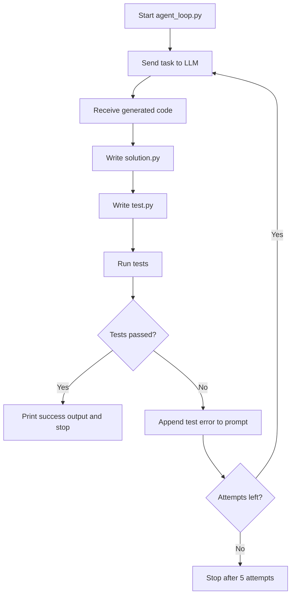

# Agent Loop

This project is a very small Hello World Python Agent that write code, saves the result to `solution.py`, and runs a test file against it.

## What It Does

`agent_loop.py`:

- sends a coding task to an Ollama model
- writes the returned code to `solution.py`
- writes tests to `test.py`
- runs the tests
- retries up to 5 times if the tests fail

## How To Run

Make sure you have:

- Python
- Ollama running locally
- the model from `agent_loop.py` available locally

Then run:

```bash
python agent_loop.py
```

Files created during execution:

- `solution.py`
- `test.py`

## Flow


